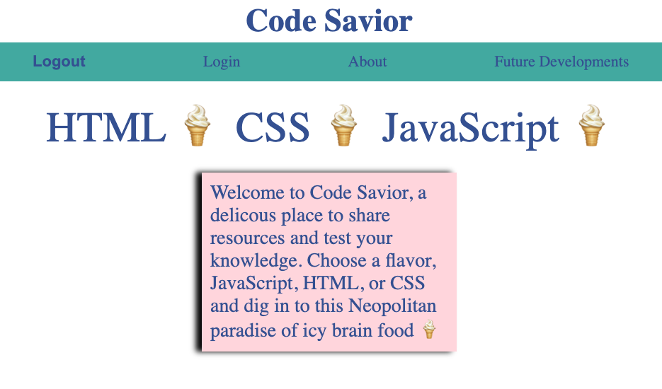

# Code Savior
Code Savior is a web application for sharing study resources and practicing coding quizzes.

Deployment: https://codesavior.herokuapp.com/ 

## Table of Contents

- [Installation](#installation)
- [Usage](#usage)
- [License](#license)
- [Contributions](#contributions)
- [Technologies](#technologies)
- [Credits](#credits)
- [Questions](#questions)

## Installation

Install MySQL on your machine. Use "npm install" to install required modules for this application. Create your own .env file add add your MySQL credentials. To seed data, run "node seeds/index.js".

## Usage

Click login, and create a new user. Select HTML, CSS, or JavaScript to see each topic's main page. Select View Resources or Take A Quiz. 

Click "Profile" to create a new post. Enter a title, enter "js", "css", or "html" for the topic, enter a link, and some text explaining the resource. 

## License

This project is licensed under the MIT license.

## Contributions

Fork the project and create a pull request. Let us know how you think you can contribute!

## Technologies

Created with Node.js, Express.js, MySQL, MySQL2, Sequelize, SASS, Mocha, Dotenv, Insomnia, and Node.js.

## Credits

Created by Joshua Schermann, Nahom Assefa, and Michael Tackett

## Questions

Post an issue if you see a bug or suggested improvement.